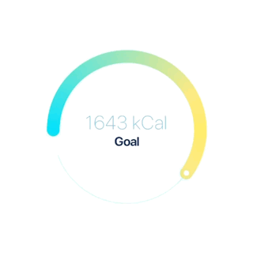
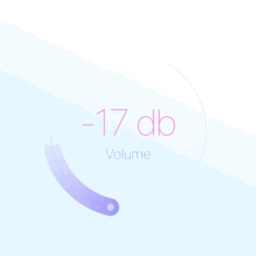
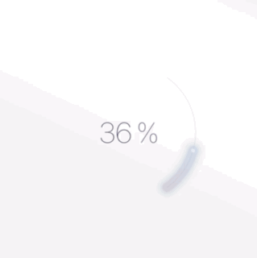
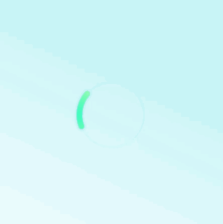

# Sleek circular slider/progress bar & spinner for Flutter
[](https://opensource.org/licenses/MIT)[](https://nuckowski.com)

A highly customizable circular slider/progress bar & spinner for Flutter.

 
 
 
 
 
 

## Getting Started

- [Installation](#installation)
- [Basic Usage](#basic-usage)
- [SleekCircularSlider parameters](#sleekcircularslider-parameters)
- [CircularSliderAppearance parameters](#circularsliderappearance-parameters)
- [CustomSliderWidths parameters](#customsliderwidths-parameters)
- [CustomSliderColors parameters](#customslidercolors-parameters)
- [InfoProperties parameters](#infoproperties-parameters)
- [YouTube video](#youtube-video)

### Installation

Add

```bash

sleek_circular_slider : ^lastest_version

```

to your pubspec.yaml, and run

```bash
flutter packages get
```

in your project's root directory.

### Basic Usage


Import it to your project file

```dart
import 'package:sleek_circular_slider/sleek_circular_slider.dart';
```

And add it in its most basic form like it:

```dart
final slider = SleekCircularSlider(
                      appearance: CircularSliderAppearance(),
                      onChange: (double value) {
                        print(value);
                      });
```

There are additional optional parameters one can initialize the slider with.

```dart
final slider = SleekCircularSlider(
  min: 0,
  max: 1000,
  initialValue: 426,
  onChange: (double value) {
    // callback providing a value while its being changed (with a pan gesture)
  },
  onChangeStart: (double startValue) {
    // callback providing a starting value (when a pan gesture starts)
  },
  onChangeEnd: (double endValue) {
    // ucallback providing an ending value (when a pan gesture ends)
  },
  innerWidget: (double value) {
    // use your custom widget inside the slider (gets a slider value from the callback)
  },
);
```

### Use as a progress bar
Slider user's interaction will be disabled if there is either no [onChange] or [onChangeEnd] provided. That way one can use the widget not as a slider but as a progress bar.

```dart
final slider = SleekCircularSlider(
  appearance: CircularSliderAppearance(
    customWidths: CustomSliderWidths(progressBarWidth: 10)),
  min: 10,
  max: 28,
  initialValue: 14,
);
```

### Use as a spinner
There is one more use case for the library. It's a spinner which can be shown to users while loading etc. In this mode the widget is not interactive and ignores all angles so there is no need to provide them.

```dart
final slider = SleekCircularSlider(
  appearance: CircularSliderAppearance(
    spinnerMode: true,
));
```

### SleekCircularSlider parameters


| Parameter                 |                       Default                       | Description                                                                                                             |
| :------------------------ | :-------------------------------------------------: | :---------------------------------------------------------------------------------------------------------------------- |
| **appearance** *CircularSliderAppearance*    |                                                     | A set of objects describing the slider look and feel.                                                             |
| **min** *double*                     |                         0                           | The minimum value the user can select.  Must be less than or equal to max. |
| **max** *double*                     |                         100                         | The maximum value the user can select. Must be greater than or equal to min.  |
| **initialValue** *double*            |                          50                         | The initial value for this slider.                       |
| **onChange** *OnChange(double value)*|                                                     | Called during a drag when the user is selecting a new value for the slider by dragging. |
| **onChangeStart** *OnChange(double value)* |                                               | Called when the user starts selecting a new value for the slider. |
| **onChangeEnd**  *OnChange(double value)*  |                                                     | Called when the user is done selecting a new value for the slider. |
| **innerWidget** *Widget InnerWidget(double value)* |                                       | A custom widget to replace the build in text labels which can capture a slider value from the callback. |


### CircularSliderAppearance parameters

| Parameter                 |                       Default                       | Description                                                                                                             |
| :------------------------ | :-------------------------------------------------: | :---------------------------------------------------------------------------------------------------------------------- |
| **size** *double*                    |                        150                          | The width & height value for the slider.                    |
| **startAngle** *double*              |                        150                          | The angle (in degrees) the slider begins with.            |
| **angleRange** *double*              |                        240                          | The angle range (in degrees) the slider reaches when maximum value set. |
| **counterClockwise** *bool*          |                       false                         | The setting indicating direction of the widget.                         |
| **customWidths** *CustomSliderWidths*|                                                     | The object with a set of widths for the track, bar, shadow etc.        |
| **customColors** *CustomSliderColors*|                                                     | The object with a set of colors for the track, bar, shadow etc.        |
| **infoProperties** *InfoProperties*  |                                                     | The object with a set of properties for internal labels displaying a current slider value. |
| **animationEnabled** *bool*          |                       true                          | The setting indicating whether external changes of a slider value should be animated.  |
| **spinnerMode** *bool*               |                       false                         | The setting turning the widget into a spinner.                        |
| **spinnerDuration** *int*            |                        1500                         | The spinner animation duration in miliseconds                            |


### CustomSliderWidths parameters

| Parameter                 |                       Default                       | Description                                                                                                             |
| :------------------------ | :-------------------------------------------------: | :---------------------------------------------------------------------------------------------------------------------- |
| **trackWidth** *double*              |                progressBarWidth / 4                 | The width of the slider's track.                        |
| **progressBarWidth** *double*        |                 slider's size / 10                  | The width of the slider's progress bar.                 |
| **shadowWidth** *double*             |                progressBarWidth * 1.4               | The width of the slider's shadow.  |
| **handlerSize** *double*             |                progressBarWidth / 5                 | The size of the slider's handler. |


### CustomSliderColors parameters

| Parameter                 |                       Default                       | Description                                                                                                             |
| :------------------------ | :-------------------------------------------------: | :---------------------------------------------------------------------------------------------------------------------- |
| **trackColor** *Color*               |                #DCBEFB                              | The color of the slider's track.                        |
| **progressBarColor** *Color*         |                                                     | The color of the slider's progress bar. Won't be used if the slider uses gradient **progressBarColors != null**  |
| **progressBarColors** *List<Color>*  |      [#1E003B, #EC008A, #6285DA]                    | The list of colors for the progress bar's gradient.       |
| **gradientStartAngle** *double*      |                   0                                 | The start angle for the progress bar's gradient.           |
| **gradientEndAngle** *double*        |                  180                                | The end angle for the progress bar's gradient.           |
| **dotColor** *Color*                 |                #FFFFFF                              | The color of the slider's handle.                       |
| **hideShadow** *bool*                |                  false                              | The setting indicating whether the shadow should be showed. |
| **shadowColor** *Color*              |                #2C57C0                              | The color of the shadow. |
| **shadowMaxOpacity** *double*        |                    0.2                              | The opacity of the shadow in its darker part.             |
| **shadowStep** *double*              |                                                     | The shadow is being painted with a number of steps. This value determines how big is a width of each step. The more steps are painted the softer the shadow is. For a flat shadow use a difference between the **shadowWidth** and the **progressWidth** for the **shadowStep**.|


### InfoProperties parameters

| Parameter                 |                       Default                       | Description                                                                                                             |
| :------------------------ | :-------------------------------------------------: | :---------------------------------------------------------------------------------------------------------------------- |
| **mainLabelStyle** *TextStyle*       |                                                     | The text style of the main text widget displaying a slider's current value.     |
| **topLabelStyle** *TextStyle*        |                                                     | The text style of the top text widget.                   |
| **bottomLabelStyle** *TextStyle*     |                                                     | The text style of the bottom text widget.                |
| **topLabelText** *String*            |                                                     | The text for the top text widget.                           |
| **bottomLabelText** *String*         |                                                     | The text for the bottom text widget.                    |
| **modifier** *String PercentageModifier(double percentage)* | closure adding the **%** character | The closure allowing to modify how a current value of the slider is displayed. |

**Example of the modifier**
 ```dart 
 String percentageModifier(double value) {
    final roundedValue = value.ceil().toInt().toString();
    return '$roundedValue %';
  }
``` 
It will convert a current value to *int* and add the **%** sufix to it.

### YouTube video

[](https://youtu.be/ECXdRYs89QY)

## Todo

- [ ] add divisions

- [ ] add more comments to document the code

- [x] add the counterclockwise direction

- [x] add the spinner mode

- [ ] add the second handle (interval selection)

- [ ] add text labels on a curved path


## Acknowledgments

* Hat tip to David Anaya for his awesome [blog post](https://www.davidanaya.io/flutter/circular-slider.html) about building a circular slider in Flutter and radian to degrees conversions which helped me a lot!
