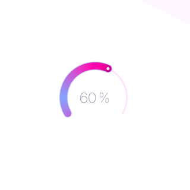
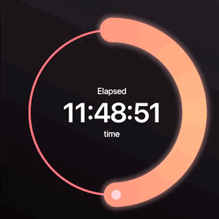
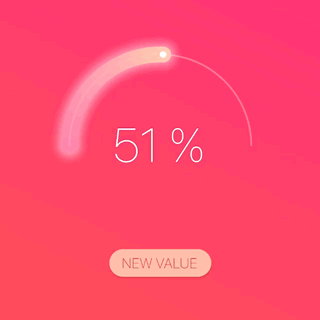
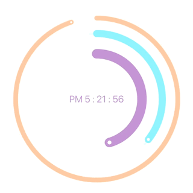

# Sleek circular slider/progress bar for Flutter

A highly customizable circular slider/progress bar for Flutter.

 
 
 
 

## Getting Started

- [Installation](#installation)
- [Basic Usage](#basic-usage)
- [Customizations](#customizations)

### Installation

Add

```bash

sleek_circular_slider : ^lastest_version

```

to your pubspec.yaml, and run

```bash
flutter packages get
```

in your project's root directory.

### Basic Usage


Import it to your project file

```dart
import 'package:sleek_circular_slider/sleek_circular_slider.dart';
```

And add it in its most basic form like it:

```dart
final slider = SleekCircularSlider(
                      appearance: CircularSliderAppearance(),
                      onChange: (double value) {
                        print(value);
                      });
```

### Customizations

First of all there are additional optional parameters one can initialize the slider with.

```dart
final slider = SleekCircularSlider(
  appearance: CircularSliderAppearance(),
  min: 0,
  max: 1000,
  initialValue: 426,
  onChange: (double value) {
    // use value while its being changed (with a pan gesture)
  },
  onChangeStart: (double startValue) {
    // use a starting value (when a pan gesture starts)
  },
  onChangeEnd: (double endValue) {
    // use an ending value (when a pan gesture ends)
  },
  innerWidget: (double vakue) {
    // use your custom widget inside the slider and provide a current value to it
  },
);
```
Slider user's interaction will be disabled if there is either no [onChange] or [onChangeEnd] provided.

| Parameter                 |                       Default                       | Description                                                                                                             |
| :------------------------ | :-------------------------------------------------: | :---------------------------------------------------------------------------------------------------------------------- |
| appearance *CircularSliderAppearance*    |                                                     | A set of objects describing the slider look and feel.                                                             |
| min *double*                     |                         0                           | The minimum value the user can select.  Must be less than or equal to max. |
| max *double*                     |                         100                         | The maximum value the user can select. Must be greater than or equal to min.  |
| initialValue *double*            |                          50                         | The initial value for this slider.                       |
| onChange *OnChange(double value)*|                                                     | Called during a drag when the user is selecting a new value for the slider by dragging. |
| onChangeStart *OnChange(double value)* |                                               | Called when the user starts selecting a new value for the slider. |
| onChangeEnd                      |                                                     | Called when the user is done selecting a new value for the slider. |
| innerWidget *Widget InnerWidget(double value)* |                                       | A custom widget to replace the build in text labels which can capture a slider value from the callback. |


### YouTube video

[](https://youtu.be/ECXdRYs89QY)
